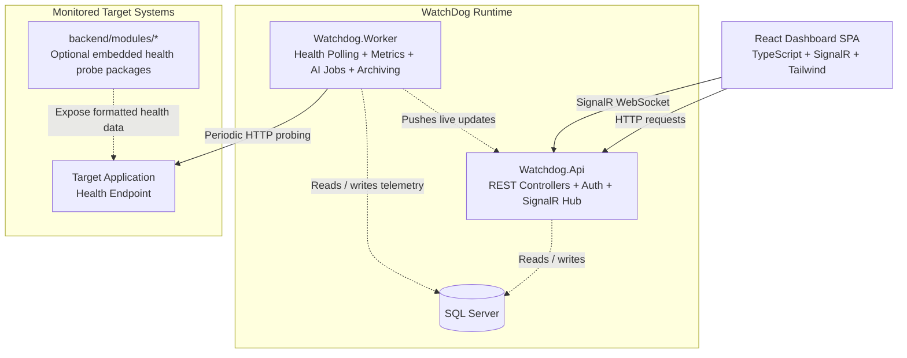
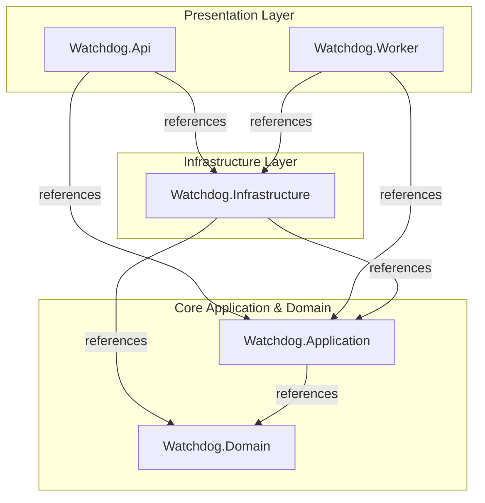

# 🛡️ WatchDog — AI-Powered Application Health & Incident Monitoring Platform

> **Real-time application health monitoring with AI-assisted incident intelligence.**

WatchDog is a full-stack application monitoring platform that tracks system health, detects incidents, reduces false positives, and provides AI-assisted root cause insights through a real-time dashboard. It combines modular health checks, background workers, rule-based incident detection, and hybrid AI providers to help teams understand application failures faster.

---

### 📊 Platform At A Glance


---

### 👁️ Platform Preview

#### Real-Time Monitoring Dashboard


#### Management Panel


---

## 📌 Project Overview

WatchDog is a full-stack application health monitoring platform built to help teams observe application availability, detect incidents, and understand failures faster.

The platform continuously monitors registered applications and their dependencies through WatchDog-compatible health endpoints, stores historical health snapshots, evaluates failures through rule-based incident logic, and displays live operational status on a real-time dashboard.

When an incident is confirmed, WatchDog can enrich the event with AI-assisted analysis using either a cloud-based OpenAI provider or a local Ollama model. This allows teams to generate contextual root cause insights without leaving the monitoring workflow.

The system is designed around a clean separation of concerns: a .NET backend for monitoring, incident management, authentication, AI orchestration and background processing; and a React + TypeScript frontend for dashboards, administration panels, AI insights and system configuration.

---

## 🎯 Why WatchDog?

Many monitoring systems stop at basic uptime checks or raw alerts. In real-world applications, however, a temporary network issue, a slow dependency, or a short-lived service interruption can easily create noisy incidents and unnecessary investigation work.

WatchDog focuses on reducing that noise by combining health polling, rule-based incident confirmation, real-time visibility and AI-assisted analysis in a single operational workflow.

### What makes WatchDog different?

- **Modular health probing model:** HTTP, TCP, Redis, RabbitMQ, MongoDB, SQL Server, SSL, system metrics and heartbeat checks are organized as isolated reusable packages, while WatchDog collects health data through configured monitoring endpoints.
- **Noise-resistant incident detection:** The incident engine evaluates repeated failures before escalation, helping reduce false positives caused by transient issues.
- **AI-assisted root cause insights:** Confirmed incidents and collected health snapshots can be analyzed through OpenAI or Ollama to produce more contextual operational insights.
- **Real-time dashboard experience:** SignalR-powered updates keep application status, incidents and system metrics synchronized without manual refreshes.
- **Admin-focused access control:** Role-based access and application-level permissions help separate responsibilities between SuperAdmins and application admins.

---

## ✨ Key Features

WatchDog combines application health monitoring, incident detection, AI-assisted diagnostics and real-time operational visibility in a single full-stack platform.

### 🔍 Continuous Application Health Monitoring

WatchDog periodically monitors registered applications based on their configured polling intervals. It collects health snapshots, evaluates application availability and tracks dependency-level status changes over time.

### 🧩 Modular Health Probe System

WatchDog includes isolated health probe packages for HTTP, TCP, Redis, RabbitMQ, MongoDB, SQL Server, SSL certificates, heartbeat checks and host system metrics. These packages are separated from the main WatchDog runtime and provide reusable probing building blocks for monitored target systems.

WatchDog itself collects health data by polling configured application endpoints, keeping the core monitoring runtime decoupled from protocol-specific probe implementations.

### 🛡️ Noise-Resistant Incident Detection

Instead of creating incidents from every temporary failure, WatchDog uses a rule-based verification flow that evaluates repeated unhealthy states before escalating an issue. This helps reduce false positives caused by short-lived network interruptions or transient dependency failures.

### 🤖 AI-Assisted Root Cause Insights

When incidents are detected, WatchDog can enrich them with AI-generated operational insights. The platform supports both cloud-based OpenAI providers and local Ollama models, allowing teams to balance analysis quality, cost and data privacy requirements.

### 📡 Real-Time Dashboard Updates

Application status, incidents, system metrics and AI insights are synchronized through a SignalR-powered real-time dashboard. Operators can follow changes without manually refreshing the interface.

### 🖥️ Host System Metrics Monitoring

WatchDog collects CPU, RAM and disk usage from the host environment and uses these metrics as additional context during health evaluation and incident analysis. The collector is designed to work across Windows, Linux and Docker-based environments.

### 🔐 Role-Based Administration

The platform separates SuperAdmin and Admin responsibilities through JWT-based authentication, protected API endpoints and frontend route guards. Standard admins are limited to the applications assigned to them, helping preserve application-level data boundaries.

### 📬 Incident Notification Workflow

WatchDog supports email-based downtime and recovery notifications. Alert messages focus on failed components and recovery status, helping administrators quickly understand what changed and where attention is needed.

### 🧹 Historical Data Archiving

A background archiving process moves older health snapshot data into compressed archive files, helping preserve database performance while keeping historical monitoring records available outside the main operational tables.

---

## 🔄 Core Execution Workflows

WatchDog is powered by background-driven workflows that continuously collect health data, evaluate incidents, notify administrators and enrich operational events with AI-assisted analysis.

### Health Monitoring Workflow

WatchDog periodically checks registered applications based on their configured polling intervals. Each cycle collects application availability, dependency health and host resource metrics, then stores the result as a historical health snapshot.

> Health Polling Worker → Target Application Health Endpoint → Health Snapshot → Dashboard

This workflow keeps application status, dependency health and system metrics continuously updated without requiring manual checks from administrators.

---

### Incident Detection & Recovery Workflow

WatchDog does not create incidents from every temporary failure. Instead, it evaluates repeated unhealthy states before opening an incident, helping reduce false positives caused by short-lived network interruptions or transient dependency issues.

> Health Snapshot → Rule-Based Evaluation → Incident State Change (Open/Resolved) → Notification + Dashboard Update

When an incident is confirmed, WatchDog stores its lifecycle, broadcasts the change to connected clients and notifies responsible administrators. When the affected component becomes healthy again, the active incident is resolved and recovery updates are sent through the same communication flow.

---

### AI Insight Workflow

WatchDog can enrich confirmed incidents and scheduled monitoring routines with AI-assisted operational analysis. Depending on the active configuration, analysis can be generated through a cloud-based OpenAI provider or a local Ollama model.

> Incident / Scheduled Routine → Snapshot Context → AI Provider → Operational Insight

These insights help administrators understand possible root causes, scaling risks and long-term system behavior from collected monitoring data.

---

### Real-Time Update & Notification Workflow

Important platform events are delivered through real-time dashboard updates and email notifications. SignalR keeps connected clients synchronized, while the notification service sends downtime and recovery emails to responsible administrators.

> Monitoring Event → SignalR Broadcast + Email Notification → Dashboard / Administrators

This allows operators to follow application health, incident changes and AI-generated insights without manually refreshing the dashboard.

---

## 🏗️ System Architecture

WatchDog is designed with a layered full-stack architecture that separates application monitoring workflows, domain rules, infrastructure integrations, background processing and user-facing dashboards.

The backend follows **Clean Architecture / Onion Architecture**, where dependencies point inward toward the core domain model. The frontend follows a **feature-driven structure** inspired by Feature-Sliced Design principles, keeping product areas such as dashboard, authentication, AI insights and system settings isolated from each other.

### Runtime Communication Flow

This diagram shows how the running system communicates at runtime.



> `backend/modules/*` packages are not directly referenced by `Watchdog.Worker`. They represent optional modular health probe packages that can be used by monitored target systems to expose structured health data. WatchDog collects that data by probing target application endpoints.

### Backend Project Dependency Graph

This diagram shows compile-time `.csproj` dependencies. It does not represent network communication.



> The **Domain layer has no project dependencies**. Infrastructure depends inward on Application and Domain contracts; Domain does not depend on Infrastructure.

### Backend Architecture

The backend is organized under `backend/src` and follows a clear separation between core business logic, application workflows, infrastructure implementations and runtime entry points.

| Layer | Project | Responsibility |
|---|---|---|
| Domain | `Watchdog.Domain` | Contains core entities, enums, value objects and business rules such as incident evaluation logic. |
| Application | `Watchdog.Application` | Coordinates business workflows through use cases, DTOs and interface contracts for repositories, AI clients and notifications. |
| Infrastructure | `Watchdog.Infrastructure` | Implements database persistence, AI providers, notification services, authentication utilities, host monitoring and external integrations. |
| Presentation | `Watchdog.Api` | Exposes REST endpoints, authentication flows, middleware and SignalR hubs for the frontend. |
| Worker Runtime | `Watchdog.Worker` | Runs background services for health polling, system metrics collection, AI analysis and data archiving. |

This structure keeps the core monitoring and incident logic independent from database access, HTTP transport, AI provider SDKs, email delivery and UI concerns.

### API and Worker Runtime Separation

WatchDog separates request/response operations from continuous background processing.

- `Watchdog.Api` handles REST requests, authentication, authorization, SignalR hubs and frontend communication.
- `Watchdog.Worker` runs long-running background workflows such as health polling, metrics collection, AI analysis and historical data archiving.

This separation helps prevent scheduled monitoring workloads from interfering with API responsiveness.

### Modular Health Check Packages

WatchDog includes isolated health check packages under `backend/modules`. These packages are separated from the main backend runtime and focus on reusable probing concerns.

```text
backend/modules/
├── HealthChecks.Abstractions
├── HealthChecks.Http
├── HealthChecks.Tcp
├── HealthChecks.SqlServer
├── HealthChecks.Redis
├── HealthChecks.RabbitMQ
├── HealthChecks.MongoDb
├── HealthChecks.Ssl
├── HealthChecks.System
└── HealthChecks.Heartbeat
```

They are not directly referenced by `Watchdog.Api`, `Watchdog.Worker` or `Watchdog.Infrastructure`. Instead, they represent reusable health check building blocks that can be used by monitored target systems to expose structured health information, while WatchDog probes those systems through HTTP endpoints.

### Frontend Architecture

The frontend is organized around product features under `frontend/src/features`, supported by shared API clients, route guards, contexts, layouts and TypeScript types.

```text
frontend/src/
├── api
├── components
├── context
├── features
│   ├── admin-management
│   ├── ai-providers
│   ├── ai-tower
│   ├── apps
│   ├── auth
│   ├── dashboard
│   └── system-settings
├── layouts
├── routes
└── types
```

This feature-driven structure keeps dashboard, authentication, monitored apps, AI provider management, AI insights and system settings separated while still sharing common infrastructure where needed.

### Key Architectural Decisions

- **Clean dependency direction:** Domain logic remains isolated from frameworks, databases, AI providers and transport details.
- **Use case based application flow:** Business workflows are implemented as focused use case classes instead of being placed directly inside controllers or background workers.
- **Separate API and Worker runtimes:** HTTP-facing operations and background monitoring jobs run in separate executables.
- **Decoupled modular health packages:** Health check packages are isolated from the WatchDog runtime and can be used as reusable probing libraries for target systems.
- **Provider-based AI integration:** OpenAI and Ollama integrations are resolved behind AI client abstractions.
- **Real-time synchronization boundary:** SignalR broadcasting is handled outside the domain model, keeping UI synchronization separate from core business rules.

---

## 📁 Repository Structure

The repository is organized as a full-stack solution with a layered .NET backend, modular health check packages, a React + TypeScript frontend and Docker-based deployment support.

```text
├── backend/
│   ├── WatchDog.slnx                         # Backend solution file
│   ├── modules/                              # Isolated health check packages
│   │   ├── HealthChecks.Abstractions/        # Shared contracts, results and status models
│   │   ├── HealthChecks.Heartbeat/           # Heartbeat-based availability checks
│   │   ├── HealthChecks.Http/                # HTTP endpoint health checks
│   │   ├── HealthChecks.MongoDb/             # MongoDB connectivity checks
│   │   ├── HealthChecks.RabbitMQ/            # RabbitMQ connectivity checks
│   │   ├── HealthChecks.Redis/               # Redis connectivity checks
│   │   ├── HealthChecks.SqlServer/           # SQL Server connectivity checks
│   │   ├── HealthChecks.Ssl/                 # SSL certificate validation checks
│   │   ├── HealthChecks.System/              # CPU, memory and disk usage checks
│   │   └── HealthChecks.Tcp/                 # TCP port connectivity checks
│   │
│   └── src/
│       ├── Core/
│       │   ├── Watchdog.Domain/              # Domain entities, enums, rules and value objects
│       │   │   ├── Common/
│       │   │   ├── Constants/
│       │   │   ├── Entities/
│       │   │   ├── Enums/
│       │   │   ├── Rules/
│       │   │   └── ValueObjects/
│       │   │
│       │   └── Watchdog.Application/         # Use cases, DTOs, interfaces and application contracts
│       │       ├── Attributes/
│       │       ├── DTOs/
│       │       ├── Enums/
│       │       ├── Interfaces/
│       │       └── UseCases/
│       │
│       ├── Infrastructure/
│       │   └── Watchdog.Infrastructure/      # External integrations and concrete implementations
│       │       ├── AiServices/               # OpenAI, Ollama and AI client factory implementations
│       │       ├── Auth/                     # JWT and password hashing utilities
│       │       ├── Migrations/               # Entity Framework Core migrations
│       │       ├── Monitoring/               # Local host resource monitoring
│       │       ├── Notifications/            # Email and real-time notification services
│       │       ├── Persistence/              # DbContext, repositories and EF Core configurations
│       │       └── Probing/                  # Health probing client implementations
│       │
│       └── Presentation/
│           ├── Watchdog.Api/                 # ASP.NET Core REST API runtime
│           │   ├── Controllers/
│           │   ├── Hubs/
│           │   ├── Middlewares/
│           │   └── Services/
│           │
│           └── Watchdog.Worker/              # Background worker runtime
│               └── BackgroundServices/
│                   ├── AiAnalyzerWorker.cs
│                   ├── CentralMetricsCollectorWorker.cs
│                   ├── DataArchiverWorker.cs
│                   ├── HealthPollingWorker.cs
│                   ├── StrategicAnalyzerWorker.cs
│                   └── WorkerCurrentUserService.cs
│
├── frontend/
│   ├── src/
│   │   ├── api/                              # Axios clients and API service wrappers
│   │   ├── components/                       # Shared UI components
│   │   ├── context/                          # Auth and SignalR context providers
│   │   ├── features/                         # Feature-driven product modules
│   │   │   ├── admin-management/
│   │   │   ├── ai-providers/
│   │   │   ├── ai-tower/
│   │   │   ├── apps/
│   │   │   ├── auth/
│   │   │   ├── dashboard/
│   │   │   └── system-settings/
│   │   ├── layouts/                          # Application layout components
│   │   ├── routes/                           # Routing and protected route definitions
│   │   └── types/                            # Shared TypeScript types
│   │
│   ├── Dockerfile                            # Frontend container build definition
│   ├── nginx.conf                            # Nginx configuration for the SPA
│   ├── tailwind.config.js                    # Tailwind CSS configuration
│   └── vite.config.ts                        # Vite build configuration
│
└── docker-compose.yml                        # Multi-container orchestration file
```

---

## 🧩 Target Application Health Check Integration

WatchDog can monitor applications through HTTP-accessible health endpoints. The reusable packages under `backend/modules` are designed to be added to the applications that should be monitored.

These packages are not directly loaded by `Watchdog.Worker`. Instead, the target application references the required health check packages, exposes a WatchDog-compatible health endpoint, and then WatchDog periodically polls that endpoint.

```text
Target Application
        │
        ├── References WatchDog HealthCheck Packages
        ├── Registers Required Probes
        └── Exposes /health Endpoint
                    │
                    ▼
          Watchdog.Worker Polls Endpoint
                    │
                    ▼
          Health Snapshot + Incident Evaluation
```

### Integration Flow

The integration has two sides:

| Side | Purpose |
|---|---|
| Producer | Package the reusable health check libraries from `backend/modules` as local NuGet packages. |
| Consumer | Install those packages into the target application and expose a health endpoint for WatchDog. |

---

### 1. Prepare Health Check Package Metadata

Each package under `backend/modules` can be packed as a NuGet package. Before packaging, make sure the `.csproj` file of the module contains package metadata such as version, author and description.

Example package metadata:

```xml
<PropertyGroup>
    <Version>1.0.0</Version>
    <Authors>WatchDog Team</Authors>
    <Description>WatchDog system metrics health check package.</Description>
</PropertyGroup>
```

> Keep the existing target framework and build settings in the module project file. Add or update only the package metadata fields when needed.

> The target application should use a compatible .NET version with the packaged health check libraries.

---

### 2. Package the Modules as Local NuGet Packages

From the `backend/modules` directory, generate `.nupkg` files for all health check modules.

PowerShell example:

```powershell
Get-ChildItem -Filter *.csproj -Recurse | ForEach-Object {
    dotnet pack $_.FullName -c Release -o C:\LocalPackages\WatchDog
}
```

This command recursively finds all module `.csproj` files, builds them in `Release` mode and outputs the generated NuGet packages into a local package folder.

Example output folder:

```text
C:\LocalPackages\WatchDog
```

---

### 3. Handle Package Versioning and Cache

If you modify a health check package and pack it again with the same version, the target application may still restore the old cached package.

Recommended approach:

```xml
<Version>1.0.1</Version>
```

Increase the package version whenever the package implementation changes.

Alternative cache cleanup command:

```bash
dotnet nuget locals all --clear
```

---

### 4. Add a Local NuGet Feed to the Target Application

In the target application, create a `nuget.config` file next to the target `.csproj` file.

Windows example:

```xml
<?xml version="1.0" encoding="utf-8"?>
<configuration>
  <packageSources>
    <add key="nuget.org" value="https://api.nuget.org/v3/index.json" />
    <add key="WatchDogLocalFeed" value="C:\LocalPackages\WatchDog" />
  </packageSources>
</configuration>
```

> Do not commit machine-specific local package paths if the target application is shared across multiple developers.

---

### 5. Install Required Health Check Packages

Install only the health check packages required by the target application.

Example:

```bash
dotnet add package HealthChecks.System --version 1.0.0
dotnet add package HealthChecks.SqlServer --version 1.0.0
```

Depending on the application dependencies, other packages can also be installed:

```bash
dotnet add package HealthChecks.Redis --version 1.0.0
dotnet add package HealthChecks.RabbitMQ --version 1.0.0
dotnet add package HealthChecks.MongoDb --version 1.0.0
dotnet add package HealthChecks.Http --version 1.0.0
dotnet add package HealthChecks.Tcp --version 1.0.0
dotnet add package HealthChecks.Ssl --version 1.0.0
dotnet add package HealthChecks.Heartbeat --version 1.0.0
```

You can also add package references directly inside the target application's `.csproj` file:

```xml
<ItemGroup>
  <PackageReference Include="HealthChecks.System" Version="1.0.0" />
  <PackageReference Include="HealthChecks.SqlServer" Version="1.0.0" />
</ItemGroup>
```

---

### 6. Register Health Checks in the Target Application

In the target application's `Program.cs`, register the required WatchDog health checks before `builder.Build()`.

Example:

```csharp
builder.Services.AddSystemHealthChecks();

builder.Services.AddSqlServerHealthCheck(
    builder.Configuration.GetConnectionString("DefaultConnection")
);
```

The exact registrations depend on which health check packages are installed in the target application.

Example dependency mapping:

| Package | Example Purpose |
|---|---|
| `HealthChecks.System` | Exposes CPU, RAM and disk metrics. |
| `HealthChecks.SqlServer` | Checks SQL Server connectivity. |
| `HealthChecks.Redis` | Checks Redis connectivity. |
| `HealthChecks.RabbitMQ` | Checks RabbitMQ connectivity. |
| `HealthChecks.MongoDb` | Checks MongoDB connectivity. |
| `HealthChecks.Http` | Checks HTTP endpoint availability. |
| `HealthChecks.Tcp` | Checks TCP port connectivity. |
| `HealthChecks.Ssl` | Checks SSL certificate status. |
| `HealthChecks.Heartbeat` | Exposes heartbeat-based availability. |

> If you register the `HealthChecks.Heartbeat` package, make sure the target application updates its heartbeat state periodically, for example through a background worker or scheduled task. Otherwise, the heartbeat check may eventually report a timeout.

---

### 7. Expose a WatchDog-Compatible Health Endpoint

After registering the health checks, expose the collected data through an HTTP endpoint.

Add this before `app.Run()`:

```csharp
app.MapWatchdogHealthChecks("/health");
```

The target application will expose health information at:

```text
http://localhost:<PORT>/health
```

or in production-like environments:

```text
https://your-target-application.com/health
```

WatchDog can then poll this endpoint and collect health snapshots.

---

### 8. Optional CORS Configuration

If the health endpoint will be accessed directly from a browser-based client during development, configure CORS in the target application.

Add this before `builder.Build()`:

```csharp
builder.Services.AddCors(options =>
{
    options.AddPolicy("AllowWatchDog", policy =>
    {
        policy.AllowAnyOrigin()
              .AllowAnyMethod()
              .AllowAnyHeader();
    });
});
```

Then enable the policy before mapping endpoints:

```csharp
app.UseCors("AllowWatchDog");
```

> `AllowAnyOrigin()` is convenient for local development. For production-like environments, restrict the allowed origins to the actual WatchDog frontend or API address.

If the endpoint is only consumed by `Watchdog.Worker` through server-side HTTP polling, CORS is usually not required.

---

### 9. Minimal Target Application Example

A simplified target application setup can look like this:

```csharp
var builder = WebApplication.CreateBuilder(args);

builder.Services.AddSystemHealthChecks();

builder.Services.AddSqlServerHealthCheck(
    builder.Configuration.GetConnectionString("DefaultConnection")
);

builder.Services.AddCors(options =>
{
    options.AddPolicy("AllowWatchDog", policy =>
    {
        policy.AllowAnyOrigin()
              .AllowAnyMethod()
              .AllowAnyHeader();
    });
});

var app = builder.Build();

app.UseCors("AllowWatchDog");

app.MapWatchdogHealthChecks("/health");

app.Run();
```

After starting the target application, verify the endpoint manually:

```text
http://localhost:<PORT>/health
```

---

### 10. Register the Target Application in WatchDog

After the target application exposes a health endpoint, add it from the WatchDog management panel.

Example monitored endpoint:

```text
http://localhost:<PORT>/health
```

> If WatchDog is running inside Docker and the target application is running directly on your host machine, do not register the target as `localhost`. From inside a container, `localhost` points to the container itself. Use `http://host.docker.internal:<PORT>/health` or your host machine's local IP address instead.

Once registered, WatchDog will:

1. periodically poll the target application's health endpoint,
2. store health snapshots,
3. evaluate incident rules,
4. send downtime or recovery notifications,
5. update the real-time dashboard,
6. enrich confirmed incidents with AI-assisted insights when configured.

---

### Integration Summary

```text
Package modules
      ↓
Create local NuGet feed
      ↓
Install packages in target application
      ↓
Register required health checks
      ↓
Expose /health endpoint
      ↓
Register endpoint in WatchDog
      ↓
Monitor application in real time
```

---

## 🤖 Hybrid AI Architecture

WatchDog uses a hybrid AI architecture that supports both cloud-based and local AI providers. Instead of coupling the monitoring workflow directly to a single AI service, the system resolves AI clients through a provider abstraction.

This allows WatchDog to generate operational insights using OpenAI when cloud analysis is configured, or fall back to a local Ollama model when a cloud provider is not available.

```text
Incident / Scheduled Analysis
        │
        ▼
AI Client Factory
        │
        ├── OpenAI Provider
        │
        └── Local Ollama Provider
        │
        ▼
AI Insight
        │
        ├── Save to Database
        └── Broadcast to Dashboard
```

### Provider Resolution & Fallback

AI providers are resolved through `AiClientFactory`, which selects the requested provider or the globally active provider from the database.

If no active provider is configured, or if the selected cloud provider is missing an API key, WatchDog automatically falls back to a local Ollama client.

| Provider | Purpose |
|---|---|
| OpenAI | Cloud-based AI analysis for richer diagnostic reports. |
| Ollama | Local AI analysis for offline/private environments and fallback scenarios. |

The local fallback targets an Ollama instance running with the `llama3.2:1b` model. In native local development this is typically `http://localhost:11434`, while Docker-based execution may use `http://host.docker.internal:11434` so containers can reach the host machine's Ollama runtime.

### AI Insight Pipelines

WatchDog generates AI insights through both event-driven and scheduled workflows.

| Pipeline | Trigger | Output |
|---|---|---|
| Event-driven RCA | A confirmed incident is opened | `CrashWarning` |
| Routine analysis | Hourly background analysis over recent telemetry | `ScalingAdvice` or `SystemStable` |
| Strategic analysis | Daily background analysis comparing recent behavior with baseline data | `StrategicForecast` |

### Event-Driven Root Cause Analysis

When an incident is confirmed, WatchDog starts an asynchronous root cause analysis workflow without blocking the main health polling loop.

The workflow collects recent health snapshots and incident context, builds a provider-specific prompt, sends it to the active AI client, stores the generated insight and broadcasts the result to connected dashboard clients.

To reduce unnecessary API usage and dashboard noise, WatchDog applies a cooldown window before generating repeated crash analysis for the same application, unless a new failed component is detected.

### Scheduled AI Analysis

In addition to incident-based analysis, WatchDog runs scheduled AI workflows:

- **Routine analysis:** evaluates recent telemetry and generates scaling advice when abnormal behavior is detected.
- **Strategic analysis:** compares recent system behavior with historical baseline data to produce longer-term capacity and reliability insights.
- **Stable system reporting:** skips unnecessary AI calls when the collected metrics indicate a stable system state.

### Prompt Strategy

WatchDog adjusts prompt behavior based on the selected provider.

- Local Ollama prompts are optimized in English to improve consistency with smaller local models.
- OpenAI prompts are optimized for richer Turkish operational reports.
- Prompt outputs are cleaned to render properly inside dashboard widgets and AI insight panels.

### AI Tower & Real-Time Delivery

Generated insights are stored in the database and delivered to the frontend through SignalR. Users can review AI-generated diagnostics inside the dashboard and the dedicated AI Tower page.

The AI layer is designed as a diagnostic advisor. It helps administrators understand possible root causes, scaling risks and system behavior, but it does not automatically resolve incidents or modify application code.

---

## 🔐 Security & Access Control

WatchDog uses role-based access control and application-level data boundaries to separate system administration responsibilities from day-to-day monitoring access.

The security model is built around JWT authentication, protected backend endpoints, frontend route guards and use case level authorization checks.

### Authentication

Authentication is handled through a stateless JWT-based login flow.

When a user signs in, the backend validates the credentials and issues a signed JWT containing identity and role information.

| Security Area | Implementation |
|---|---|
| Token type | Stateless JWT |
| Token lifetime | 12 hours |
| Signing algorithm | HMAC SHA-256 |
| Main claims | User ID, username, email, role and token identifier |

Passwords are stored with ASP.NET Core's password hashing format. Existing legacy SHA-256 password hashes are migrated lazily: when a user signs in with a valid legacy password, the stored hash is automatically upgraded to the current secure format.

### Role-Based Access Control

WatchDog defines two main roles:

| Role | Responsibility |
|---|---|
| `SuperAdmin` | Manages monitored applications, admin accounts, AI providers and global system settings. |
| `Admin` | Monitors assigned applications, views dashboards, follows incidents and reviews operational insights. |

Backend endpoints are protected with authorization attributes, while the frontend uses route guards to redirect unauthenticated or unauthorized users to the appropriate pages.

### Application-Level Access Isolation

Standard admins are restricted to the applications assigned to them.

WatchDog stores allowed application identifiers for each admin user and applies this boundary inside application use cases. This prevents standard admins from discovering or accessing monitoring data that belongs to applications outside their assigned scope.

```text
Admin User → AllowedAppIds → Filtered Application Access
```

This check is enforced on the backend, so access control does not rely only on hidden frontend routes.

### Protected Operations

Sensitive operations are limited to higher-privilege users.

Examples include:

- creating, updating or deleting monitored applications,
- managing admin accounts,
- configuring AI providers,
- changing global system thresholds,
- accessing system-level administration pages.

This separation keeps operational monitoring access distinct from system configuration authority.

### Account Recovery

WatchDog includes a password recovery flow through forgot-password and reset-password endpoints.

The recovery process generates a reset code, applies expiration rules and delivers the code through the configured email notification service. When a valid code is submitted, the password is replaced with a newly hashed value.

### Security Scope

WatchDog focuses on practical application-level security controls such as authentication, authorization, role separation and scoped data access.

It does not claim to provide intrusion prevention, automatic threat detection or advanced encryption beyond the implemented access control and hashing mechanisms.

---

## 🧰 Tech Stack

WatchDog is built with a modern full-stack technology stack covering backend services, background workers, real-time communication, AI integrations, frontend dashboards and containerized deployment.

### Backend

| Area | Technology |
|---|---|
| Runtime | .NET 10 |
| API Framework | ASP.NET Core Web API |
| Background Processing | ASP.NET Core Hosted Services / BackgroundService |
| Persistence | Entity Framework Core 10 |
| Database | Microsoft SQL Server |
| Resilience | Polly |
| Authentication | JWT Authentication |
| Email Delivery | MailKit / MimeKit |
| Real-Time Communication | ASP.NET Core SignalR |

### Frontend

| Area | Technology |
|---|---|
| Framework | React 19 |
| Language | TypeScript 6 |
| Build Tool | Vite 8 |
| Styling | Tailwind CSS |
| Routing | React Router DOM |
| HTTP Client | Axios |
| Forms | React Hook Form |
| Validation | Zod |
| Notifications | Sonner |
| Icons | Lucide React |
| Real-Time Client | Microsoft SignalR Client |

### AI & Monitoring

| Area | Technology |
|---|---|
| Cloud AI Provider | OpenAI |
| Local AI Provider | Ollama |
| AI Abstraction | Microsoft.Extensions.AI |
| Local Model SDK | OllamaSharp |
| Health Probing | HTTP-based monitoring endpoints and reusable modular health check packages |
| Host Metrics | Windows Performance Counters, Linux `/proc` readers and Docker-aware memory detection |

### Infrastructure & Deployment

| Area | Technology |
|---|---|
| Containerization | Docker |
| Orchestration | Docker Compose |
| Frontend Runtime | Nginx |
| Local SMTP Testing | MailHog |
| Database Container | SQL Server 2022 |
| Archive Storage | Mounted Docker volume for compressed historical snapshots |

---

## ⚙️ Configuration & Environment Variables

WatchDog uses configuration values from `appsettings.json`, Docker environment variables, frontend Vite environment files and database-backed AI provider settings.

Sensitive values such as JWT secrets, database passwords and cloud AI API keys should always be replaced with secure values before running the project outside local development.

> The password, JWT secret and API key values shown in this section are placeholders. Real production secrets should never be written in the README or committed to the repository.

### Backend Configuration

| Key | Description | Example / Placeholder |
|---|---|---|
| `ConnectionStrings:DefaultConnection` | SQL Server connection string used by the API and Worker. | `Server=localhost,1433;Database=WatchdogDb;User Id=sa;Password=YOUR_DB_PASSWORD;TrustServerCertificate=True;` |
| `JwtSettings:SecretKey` | Secret key used to sign JWT tokens. | `YOUR_SUPER_SECURE_JWT_SECRET_KEY_MIN_32_CHARS` |
| `JwtSettings:Issuer` | JWT issuer value. | `Watchdog.Api` |
| `JwtSettings:Audience` | JWT audience value. | `Watchdog.UI` |

### Mail Configuration

| Key | Description | Example / Placeholder |
|---|---|---|
| `MailSettings:DisplayName` | Display name used in notification emails. | `WatchDog Monitoring` |
| `MailSettings:From` | Sender email address. | `no-reply@watchdog.app` |
| `MailSettings:ToEmail` | Default fallback recipient address. | `admin@example.com` |
| `MailSettings:Host` | SMTP host address. | `watchdog-mail` or `localhost` |
| `MailSettings:Port` | SMTP server port. | `1025` for MailHog |
| `MailSettings:UseSsl` | Enables or disables SSL/TLS for SMTP. | `false` for MailHog |

### Frontend Configuration

| Key | Description | Example |
|---|---|---|
| `VITE_API_URL` | Base URL used by the React frontend for API and SignalR communication. | `http://localhost:5226` |

Example `frontend/.env`:

```env
VITE_API_URL=http://localhost:5226
```

### Docker Environment

| Key / Mapping | Description | Example |
|---|---|---|
| `SQL_SA_PASSWORD` | SQL Server `sa` password used by the database container. | `YOUR_STRONG_SQL_PASSWORD` |
| `API_PORT` | Local host port mapped to the API container. | `5226` |
| `DB_NAME` | SQL Server database name. | `WatchdogDb` |
| `JWT_SECRET` | Secret key injected into the API container for JWT signing. | `YOUR_SUPER_SECURE_JWT_SECRET_KEY_MIN_32_CHARS` |
| `MAIL_TO_EMAIL` | Default fallback email recipient for local notifications. | `admin@example.com` |
| `./archives:/app/WatchDogArchives` | Mounted archive directory used by the Worker for compressed historical snapshot exports. | `./archives` |

### AI Provider Configuration

AI providers are configured through the application database and management UI instead of static environment variables.

| Field | Description | Example |
|---|---|---|
| `ApiKey` | Cloud provider API key used for OpenAI-based analysis. | `YOUR_OPENAI_API_KEY` |
| `ModelName` | Model name used by the selected AI provider. | `gpt-4o-mini` or `llama3.2:1b` |
| `Endpoint` | AI provider endpoint. | `http://localhost:11434` for Ollama |

If no active cloud provider is configured, or if the selected provider does not have a valid API key, WatchDog can fall back to the local Ollama provider.

### Production Notes

- Replace all local development passwords and secrets before deployment.
- Prefer Docker environment overrides or secret managers for production values.
- Do not commit real JWT secrets, database passwords or AI API keys.
- Ensure the Worker container has write access to the mounted archive directory.
- Use MailHog only for local email testing; configure a real SMTP provider for production-like environments.

---

## 🚀 Getting Started & Installation

The recommended way to run WatchDog locally is through Docker Compose. This starts the database, API, background worker, React dashboard and MailHog SMTP testing service together.

### Prerequisites

Make sure the following tools are installed:

| Tool | Purpose |
|---|---|
| .NET 10 SDK | Backend API and Worker development |
| Node.js 20.19+ or 22.12+ / npm | Frontend development |
| Docker & Docker Compose | Recommended full-stack local runtime |
| SQL Server | Optional, only required for non-Docker local development |
| Ollama | Optional, required for local AI analysis with the default `llama3.2:1b` model |

---

### Run with Docker Compose

Create a `.env` file in the repository root, next to `docker-compose.yml`. You can copy `.env.example` and replace the placeholder values:

```env
SQL_SA_PASSWORD=YOUR_STRONG_SQL_PASSWORD
API_PORT=5226
DB_NAME=WatchdogDb
JWT_SECRET=YOUR_SUPER_SECURE_JWT_SECRET_KEY_MIN_32_CHARS
MAIL_TO_EMAIL=admin@example.com
```

> Replace the placeholder values with your own local development values. Do not use real production credentials in this file.

Start the full stack:

```bash
docker compose up --build -d
```

After the containers start, the services will be available at:

| Service | URL / Port | Description |
|---|---|---|
| React Dashboard | `http://localhost:5174` | WatchDog web interface |
| REST API | `http://localhost:5226` | ASP.NET Core API |
| SQL Server | `localhost:1433` | Database container |
| MailHog UI | `http://localhost:8025` | Local SMTP inbox |
| MailHog SMTP | `1025` | SMTP capture port |
| Worker | Internal container | Background polling, AI analysis and archiving |

The Worker does not expose a public port. It runs in the background and writes compressed archive files to the mounted `./archives` directory.

> If you change `API_PORT`, rebuild the frontend container with `docker compose up --build -d` so the Docker build argument updates the Vite API URL embedded in the static frontend bundle.

---

### Database Migration & Seed Data

WatchDog applies database migrations automatically when the API starts.

The startup process runs the database seeder, which applies pending Entity Framework Core migrations and creates the initial configuration required to use the platform.

For local development and first-time setup, the seeder creates a default SuperAdmin account if no SuperAdmin exists:

| Field | Value |
|---|---|
| Username | `admin` |
| Password | `Admin123!` |

The seeder also creates default system threshold settings and registers a local Ollama AI provider using the `llama3.2:1b` model.

To use the default local AI provider, make sure Ollama is installed, running, and the required model is available:

```bash
ollama pull llama3.2:1b
```

If you are not using Ollama Desktop, start the Ollama runtime manually:

```bash
ollama serve
```

> This default account is intended only for local development and first-time setup. Change the default admin password immediately after the first login.

---

### Run Locally Without Docker

If you prefer to debug each project separately, you can run the API, Worker and frontend manually.

Docker and local runs can use different databases and secrets. Docker reads values from the repository root `.env` file, while local `dotnet run` should read private values from user-secrets or machine environment variables. This keeps committed config files safe while still allowing both environments to work.

> If you run Docker API and local API at the same time, they cannot both use port `5226`. Change either `API_PORT` in the Docker `.env` file or the local API URL in `launchSettings.json`.

#### 1. Prepare SQL Server and SMTP

Make sure SQL Server is available for the local API and Worker. To keep local data separate from Docker data, use a different database name or a different SQL Server instance.

Example local database name:

```text
WatchdogLocalDb
```

For local email testing, you can start MailHog separately:

```bash
docker run -d -p 1025:1025 -p 8025:8025 mailhog/mailhog
```

#### 2. Start the Backend API

Configure the API connection string and JWT secret through user-secrets or environment variables. The committed `appsettings.json` file intentionally contains placeholders only:

```text
backend/src/Presentation/Watchdog.Api/appsettings.json
```

Example user-secrets setup:

```bash
cd backend/src/Presentation/Watchdog.Api
dotnet user-secrets set "ConnectionStrings:DefaultConnection" "Server=localhost,1433;Database=WatchdogLocalDb;User Id=sa;Password=YOUR_DB_PASSWORD;TrustServerCertificate=True;Encrypt=False"
dotnet user-secrets set "JwtSettings:SecretKey" "YOUR_SUPER_SECURE_JWT_SECRET_KEY_MIN_32_CHARS"
dotnet user-secrets set "MailSettings:Host" "localhost"
dotnet user-secrets set "MailSettings:ToEmail" "admin@example.com"
```

Then run:

```bash
cd backend/src/Presentation/Watchdog.Api
dotnet run
```

The API will start on:

```text
http://localhost:5226
```

#### 3. Start the Background Worker

The Worker uses the same connection string configuration pattern as the API. Set its local values separately before running it because the Worker is a different project:

```bash
cd backend/src/Presentation/Watchdog.Worker
dotnet user-secrets set "ConnectionStrings:DefaultConnection" "Server=localhost,1433;Database=WatchdogLocalDb;User Id=sa;Password=YOUR_DB_PASSWORD;TrustServerCertificate=True;Encrypt=False"
dotnet user-secrets set "MailSettings:Host" "localhost"
dotnet user-secrets set "MailSettings:ToEmail" "admin@example.com"
```

Then run:

```bash
dotnet run
```

When the API and Worker point to `WatchdogLocalDb`, local data stays separate from the Docker database configured through root `.env`.

#### 4. Start the React Frontend

The frontend uses `http://localhost:5226` as the default API URL. If your local API runs on a different port, create or update `frontend/.env`:

```env
VITE_API_URL=http://localhost:5226
```

Then run:

```bash
cd frontend
npm install
npm run dev
```

The frontend will start on Vite’s local development port, usually:

```text
http://localhost:5173
```

or the configured Docker/local port:

```text
http://localhost:5174
```

For local development, you can sign in with the default SuperAdmin account:

```text
Username: admin
Password: Admin123!
```

> Change this password immediately after the first login.

---

## 🐳 Docker Deployment

WatchDog includes a Docker Compose setup for running the full platform as a multi-container local environment.

The Compose stack starts the database, API, background worker, frontend dashboard and local SMTP testing service together.

```text
┌──────────────────────┐
│     watchdog-ui      │
│ React + Nginx        │
│ http://localhost:5174│
└──────────┬───────────┘
           │
           ▼
┌──────────────────────┐
│     watchdog-api     │
│ ASP.NET Core Web API │
│ http://localhost:5226│
└──────────┬───────────┘
           │
           ▼
┌──────────────────────┐
│     watchdog-db      │
│ SQL Server 2022      │
│ localhost:1433       │
└──────────────────────┘

┌──────────────────────┐
│   watchdog-worker    │
│ Background Services  │
│ Internal container   │
└──────────┬───────────┘
           │
           ▼
┌──────────────────────┐
│    Archive Volume    │
│ ./archives           │
└──────────────────────┘

┌──────────────────────┐
│    watchdog-mail     │
│ MailHog SMTP Testing │
│ http://localhost:8025│
└──────────────────────┘
```

### Services

| Service | Purpose | Exposed Port |
|---|---|---|
| `watchdog-ui` | Serves the compiled React dashboard through Nginx. | `5174:80` |
| `watchdog-api` | Hosts the ASP.NET Core REST API and SignalR hub. | `5226:8080` |
| `watchdog-worker` | Runs health polling, metrics collection, AI analysis and data archiving jobs. | Internal only |
| `watchdog-db` | Stores application data in SQL Server 2022. | `1433:1433` |
| `watchdog-mail` | Captures local SMTP emails through MailHog. | `1025`, `8025` |

### Start the Stack

From the repository root:

```bash
docker compose up --build -d
```

### Stop the Stack

```bash
docker compose down
```

### View Logs

```bash
docker compose logs -f
```

To inspect a specific service:

```bash
docker compose logs -f watchdog-api
docker compose logs -f watchdog-worker
docker compose logs -f watchdog-ui
```

### Archive Volume

The Worker container writes compressed historical snapshot archives to a mounted local directory:

```text
./archives:/app/WatchDogArchives
```

Make sure the `archives` directory is writable by Docker, especially when running the stack on Linux or inside restricted environments.

### Local SMTP Testing

MailHog is included for local email testing.

- SMTP server: `watchdog-mail:1025`
- Web inbox: `http://localhost:8025`

Downtime, recovery and password reset emails can be inspected from the MailHog web interface during development.

---

## 👥 Contributors

WatchDog was collaboratively developed by:

| Name | GitHub | LinkedIn |
|---|---|---|
| Berke Büyükköprü | [BerkeBuyukkopru](https://github.com/BerkeBuyukkopru) | [berke-buyukkopru](https://www.linkedin.com/in/berke-buyukkopru/) |
| Furkan Acu | [Acufurkan](https://github.com/Acufurkan) | [furkan-acu](https://www.linkedin.com/in/furkan-acu-b22738298/) |

---

## 📄 License

This project is licensed under the [MIT License](LICENSE).
